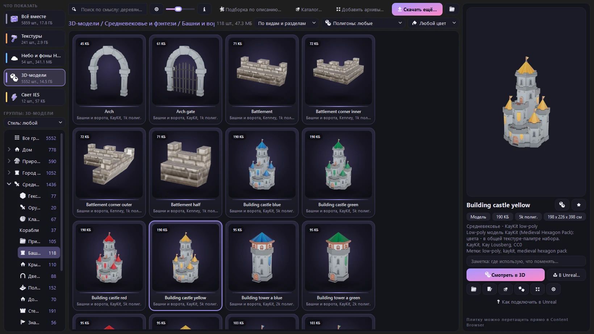
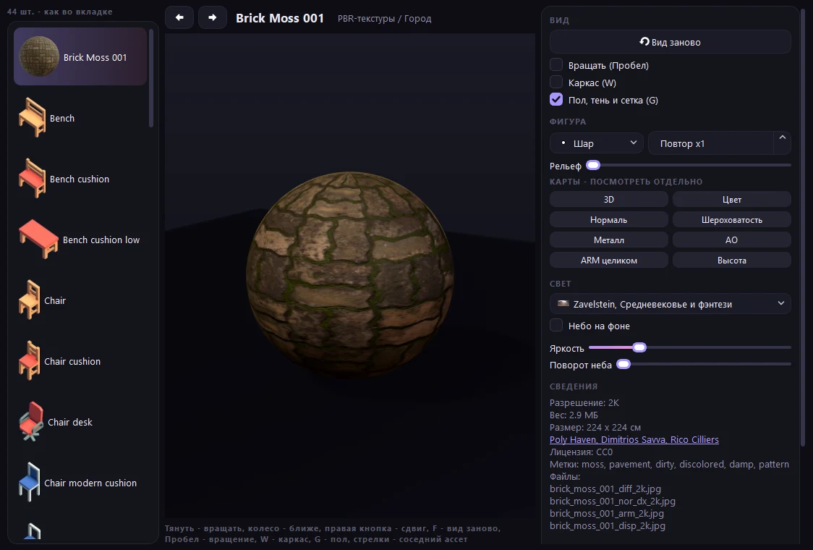
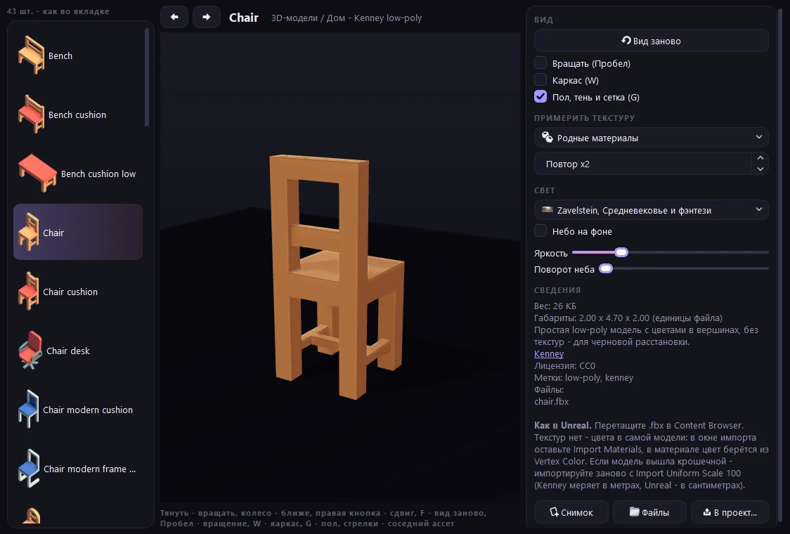
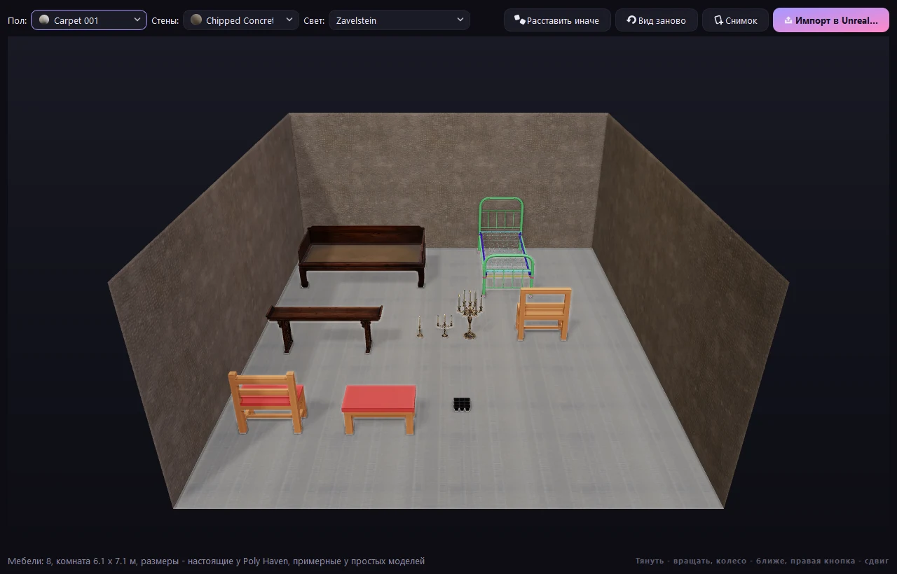
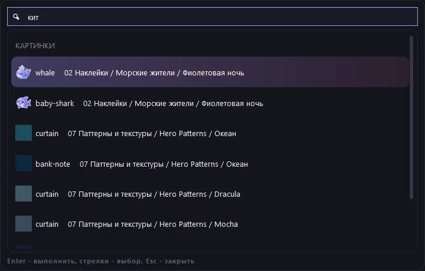
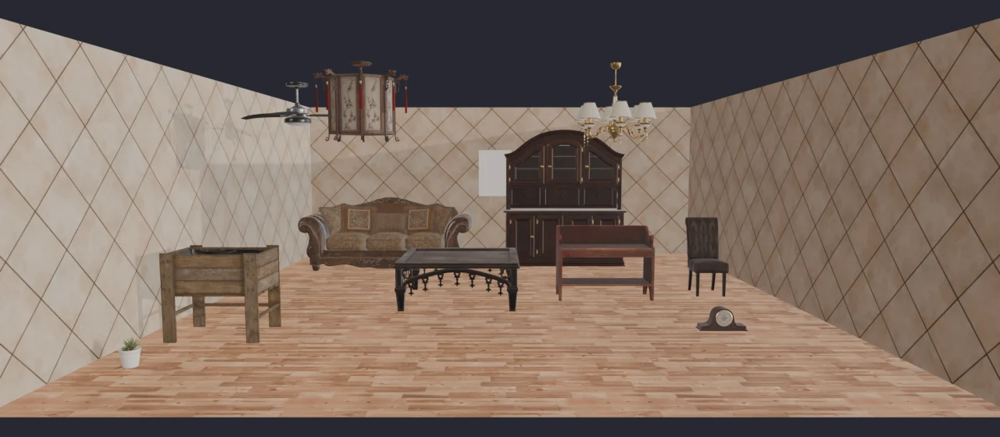
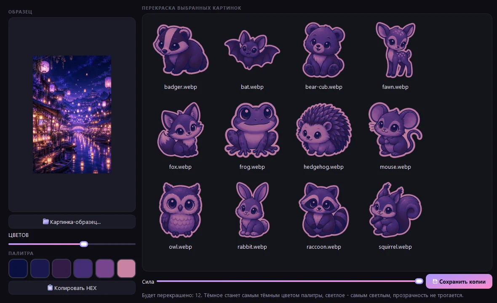
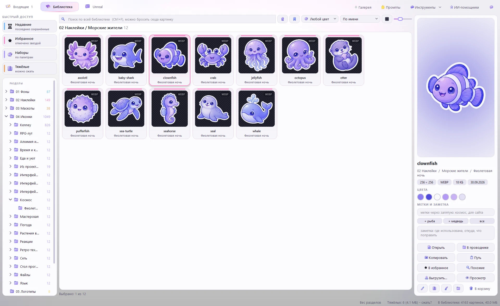

<div align="center">

[Русский](README.md) | **English**


# Picture Library

### A personal library of icons, stickers and backgrounds with a sorting window: cuts generated sheets, files them, searches by meaning

4x3 sheet cutting with preview, filing by section and palette, semantic search in Russian and English<br>
tag and folder suggestions, smart folders, neural background removal and x4 upscaling<br>
AI assistants (Claude, Cursor) search, view and edit pictures - every change shows up in the window and can be undone<br>
an "Unreal" tab: textures, HDRIs, models and lights for Unreal Engine with a 3D viewer

[](https://github.com/moonlivedt-oss/photosMOONprojects/actions/workflows/ci.yml)


<sub>One folder, PyQt6 window, Pillow and numpy core, semantic search on onnxruntime</sub>

</div>

---

## Quick start

```bash
py -3.14 -m pip install PyQt6 pillow numpy onnxruntime
py -3.14 _tools/get_models.py      # neural models, ~460 MB, once (or by part: clip, bg, upscale)
```

Then run **`Library.cmd`** - a window opens with three tabs: "Входящие" (Inbox), "Библиотека" (Library) and "Unreal".
The interface is in Russian.

```bash
_tools\run-tests.cmd                            # all tests (99 checks, no window)
py -3.14 _tools/cli.py gallery                  # rebuild Gallery.html - the whole library in a browser
py -3.14 _tools/cli.py cut sheet.png --grid 4x3  # cut a sheet without the window
```

To connect an AI assistant (Claude Code, Claude Desktop, Cursor) use the **"ИИ-помощники"** (AI assistants)
button in the window or see [AI assistants](#ai-assistants) below. Claude Code opened in this folder finds the
library by itself.

> Without the models the window works as before; only semantic search and tag suggestions are hidden.
> The prompts page (`Prompts.html`) and the "what is missing" table need node.

## What it is

Pictures for projects (icons, stickers, mascots, backgrounds) are generated as sheets of 12 and
tend to scatter across project folders. **Picture Library** keeps them in one place **by type**,
not by project, and takes over the routine: a sheet dropped into the inbox is cut by grid, its
pieces are named from the prompt list, pieces already in the library are marked, tags are
suggested, and everything is filed into the right section and palette.

| | Plain folder | Asset managers (Eagle etc.) | Picture Library |
|---|---|---|---|
| Cutting a sheet into pieces | by hand | no | **yes - grid or auto search, preview, manual boxes** |
| Filing into sections | by hand | by hand | **yes - automatically from a tag in the file name** |
| "Already have it" | no | no | **yes - fingerprints, repeats are not saved** |
| Search by meaning | no | paid AI features | **yes - local, Russian and English** |
| Search by image | no | partly | **yes - drop a file onto the search field** |
| Tag suggestions | no | no | **yes - from piece meaning, one click** |
| Smart folders | no | yes | **yes - saved search: words, color, meaning** |
| Perceptual compression | no | no | **yes - SSIM-based quality, lightest format** |
| Export to a project | by hand | partly | **yes - format, size, @2x/@3x, atlas, svg sprite** |
| AI assistants | no | no | **yes - MCP server: search, view, edit, file; everything is undoable** |
| Undo | recycle bin | partly | **yes - any action, even after restarting the window** |
| Where data lives | on disk | own database | **on disk, plain files and folders** |

---

## Features

| Feature | Details |
|---|---|
| **Inbox** | sheets from `00 Входящие`, drag and drop or Ctrl+V; watching the generator folder; a background or illustration is kept whole, a single drawing is cut out |
| **"Looks like: folder"** | from the meaning of the pieces the window suggests the folder where similar pictures already live |
| **AI assistants** | Claude, Cursor etc. over MCP or the command line: search, view, tag, move, edit, remove background, upscale, cut sheets, export; their actions pop up in the window with an "Undo" button; read-only mode |
| **Cutting** | 4x3 grid (neighbours touching by outline are split), auto search, whole picture; background removal, white outline, padding, size, format; hand-editable boxes |
| **Tag in the name** | a file `Космос [ic tokyo]` picks the cutting, section and palette itself and takes the 12 piece names from `Prompts.html` |
| **Semantic search** | crystal-ball button (Ctrl+M): "cat in space", "sad mascot" - no words in file names needed |
| **Unreal** (Ctrl+3) | PBR textures, HDRI skies, 3D models and IES light profiles by theme; 3D viewer (model, texture on a sphere, 360 panorama); "Download more..." fetches CC0 assets from Poly Haven and ambientCG; drag a tile straight into the Content Browser |
| **Search by image** | drop a file or a tile onto the search field; "Similar" and "Similar by meaning" in the tile menu |
| **Tags** | suggestions in the inbox and for the selected picture, optional auto-tagging for batch filing; tags and notes are searchable |
| **Neural editing** | remove any background (BiRefNet-lite), sharp x2/x4 upscaling (Real-ESRGAN, separate models for art and photos); CLI `nobg`, `upscale`, `cut --bg ai` |
| **Bulk tags, usage log** | apply suggested tags to a whole section; export (Ctrl+E) remembers which project folder a picture went to |
| **Smart folders** | save a search (words, color, meaning) - the folder in the tree fills itself |
| **Color search, sets** | 10 colors by dominant colors; sets with palette subfolders shown as one cover |
| **Editor** (Ctrl+R) | crop, rotate, color, recolor to palette, remove background and fringe, brush, outline, shadow, glow, rounding, resize; recipes; batch edit |
| **Compression** (Ctrl+K) | "no visible difference" quality (SSIM + color drift), lightest format, KB budget, before/after slider, all CPU cores |
| **Export** (Ctrl+E) | format, size, @1x/@2x/@3x, budget, svg (vtracer), png+json+css atlas, svg sprite |
| **Doctor and duplicates** | empty, cut off, leftover background, fringe, neighbour piece; duplicates go to `_duplicates` |
| **Undo** | Ctrl+Z / Ctrl+Y, a history menu and an "Undo" button in notifications - for saving, moving, renaming, deleting, compression, edits and assistant actions; history survives restarts; originals wait in `_sources` |
| **Help** (F1) | sections with search; "What's new" after an update, "Getting started" on the first run |

<div align="center">

<br><sub>Inbox: the sheet is cut by grid, repeats are marked, suggested tags on the right</sub>
</div>

<div align="center">

<br><sub>Semantic search: none of the query words are in the file names; matching Unreal assets on top</sub>
</div>

## Unreal Engine assets

<div align="center">

<br><sub>The "Unreal" tab: home models by purpose, live 3D on the right, drag a tile into the Content Browser</sub>
</div>

The **Unreal** tab (Ctrl+3) keeps 3D assets apart from the pictures, in `_Unreal/<kind>/<theme>/<name>/` (not in git):
PBR textures (DirectX normal, packed ARM), HDRI skies, FBX models and 12 generated IES light profiles. Assets are
CC0 from [Poly Haven](https://polyhaven.com), [ambientCG](https://ambientcg.com), [Kenney](https://kenney.nl) and
[Quaternius](https://quaternius.com). The tab has semantic search, a Poly Haven catalog, collections, filters by
polycount and color, re-download in 1K/2K/4K and a one-click import script for Unreal (`import_to_unreal.py`:
texture settings and an `M_<name>` material).

<div align="center">


<br><sub>3D viewer on Qt Quick 3D: texture on a sphere with every map separately; a model on a floor with a shadow</sub>
</div>

<div align="center">

<br><sub>Room draft from a collection: real-scale furniture, floor and walls from downloaded textures, HDRI light</sub>
</div>

## Find anywhere (Ctrl+P)

One line for the whole window: commands, folders, pictures (by name, or by meaning when no name matches) and
Unreal assets.

<div align="center">

</div>

### Room from a description, Blender and Unreal in one click

"Подборка по описанию" (room from a description): type "a cozy Scandinavian bedroom" and the AI picks items per
section, floor, walls and light from the downloaded assets (realistic and low-poly are not mixed; "another
option" on every row). The result opens **in Blender** (models at real scale, PBR materials with the DirectX
normal flipped, chandeliers on the ceiling, pictures on the wall, saved as .blend) or is **imported straight
into an Unreal project** without opening the editor (pythonscript commandlet; tested on UE 5.8). A **project
pack** bundles the files, the import script, CREDITS.md and manifest.json. AI assistants get the same through
`ue_plan_room`, `ue_blender` (returns a render), `ue_import`, `ue_pack` and more.

<div align="center">


</div>

## Tools and themes

The "Инструменты" (Tools) menu: duplicates, doctor, missing sets, folder weights, **palette from a picture** (and
recoloring other pictures into it), **comparing two versions** (slider, difference, SSIM), **SVG tracing** with
three variants side by side and a **light or dark theme** with five accents.

<div align="center">


<br><sub>Palette from a picture; the light theme</sub>
</div>

---

## AI assistants

<div align="center">

<br><sub>The assistant tagged pictures - the window shows it at once and offers to undo</sub>
</div>

Claude, Cursor and other assistants use the library as a tool: "find stickers with cats and tag them",
"remove the background from these three and put copies into 02 Наклейки/Котики", "cut the sheet in the inbox",
"export the space icons to D:/site/assets as 128 px webp".

**Connect** with the "ИИ-помощники" button at the top of the window: Claude Desktop, Cursor, VS Code (Copilot),
Windsurf, Cline, Roo Code, LM Studio and Gemini CLI in one click (the server is added to their config, the old
file is kept as `.bak`); a ready command for Claude Code and Codex CLI, a config block for the rest. In this folder Claude Code finds the server via
`.mcp.json`. Without MCP the same operations are available from the shell: `py -3.14 _tools/cli.py api`.

| What | Tools |
|---|---|
| Orientation | `overview`, `list_folder`, `inbox`, `palettes`, `history` |
| Find | `search` (words, tags, color, meaning), `similar`, `duplicates`, `check` (doctor) |
| Look | `view` - a picture or a numbered contact sheet comes back as an image; `info` |
| Label | `suggest_tags`, `tag`, `note`, `favorite`, `smart_folder` |
| File | `rename`, `move`, `trash`, `import_images`, `cut_sheet` |
| Edit | `edit` (editor recipe, preview first), `remove_background`, `upscale`, `convert` |
| Deliver | `export` (formats, @2x/@3x, atlas, svg sprite) |
| Revert | `undo` |

**Safe by design.** Every assistant action goes to a shared journal: the window shows it with an "Undo"
button and puts it into History (Ctrl+Z). Deleted pictures are not erased but kept in `_sources/_deleted`;
replaced originals go to `_sources/edit <date>`. Assistants can be limited to search and viewing.
Guidance for assistants: [AGENTS.md](AGENTS.md).

<div align="center">

</div>

---

## Semantic search

Runs entirely on this computer with `onnxruntime` (no torch):

- **images** - CLIP ViT-B/32, quantized ONNX
  [`Xenova/clip-vit-base-patch32`](https://huggingface.co/Xenova/clip-vit-base-patch32);
- **text** - multilingual encoder
  [`sentence-transformers/clip-ViT-B-32-multilingual-v1`](https://huggingface.co/sentence-transformers/clip-ViT-B-32-multilingual-v1)
  (50+ languages in the same space as the images).

The models (~225 MB) are not in the repository - GitHub rejects files over 100 MB - and are
downloaded once with `py -3.14 _tools/get_models.py`. Image vectors are computed in the background
and stored in the database. Similarity to the average library picture (or to generic words, for
text) is subtracted, so small flat UI parts do not float to the top of every query.

## Command line

```bash
py -3.14 _tools/cli.py cut sheet.png --grid 4x3 --names a,b,c --outline 8 --bg auto
py -3.14 _tools/cli.py convert folder --to webp --max 1920 [--replace]
py -3.14 _tools/cli.py dupes [folder]
py -3.14 _tools/cli.py gallery
py -3.14 _tools/cli.py unreal get tex "Город" --count 6 --res 2k   # Unreal assets: tex | hdri | model | ies
py -3.14 _tools/cli.py api                                  # assistant tools, JSON output
py -3.14 _tools/cli.py api search '{"query": "cozy night street"}'
```

## If something breaks

"Инструменты" -> "Проверка и восстановление" (Tools -> Check and restore, also via Ctrl+P) shows the state of the
settings, the database, backups, models and disk space, fixes problems in one click and restores backups.
The database (tags, notes, favorites, smart folders, undo journal) and the settings are backed up daily into
`_tools/_backups` (last 10). A damaged file is never deleted: it is moved aside as `*.broken-<time>` and the last
good backup is used. If the window does not start at all, run `_tools/repair.cmd` or
`py -3.14 _tools/cli.py repair fix`.

## Project layout

`_tools/imaging/` - Qt-free core (cutting, encoding, editing, similarity, CLIP, doctor, sprites);
`_tools/library/` - Qt-free library model shared by the window, the CLI and the MCP server (database,
action journal, search, tools for assistants); `_tools/mcp_server.py` - the MCP server; `_tools/ui/` - the PyQt6 window; `_tools/tests/` - unittest; `_sources/` - original sheets;
`_docs/` - README images. Full tree with comments: [README.md](README.md#структура-проекта).

## Privacy

Library pictures **never leave the computer**: tags, semantic search and edits are all computed locally.
The network is used only for downloads: `get_models.py` fetches the models once (Hugging Face, GitHub), and the
"Unreal" tab fetches assets from Poly Haven, ambientCG, Kenney and Quaternius' public Google Drive folders when you
press its download buttons.
The assistant server is local too and sends nothing by itself, but whatever an assistant views or reads
goes to its model, like any file you show it.

## License

Code (`_tools/`, `Library.cmd`, `Prompts.html`) - MIT, see [LICENSE](LICENSE).
Library pictures are not covered by MIT: Kenney sets - CC0, Hero Patterns - CC BY 4.0
(see `_авторы и лицензия.txt` in their folders), the rest belong to the repository author.

Changes: [CHANGELOG.md](CHANGELOG.md).

---

<div align="center">
  <sub><b>Picture Library</b> - generate a sheet, drop it into the inbox, find it by meaning.</sub>
  <br>
  <sub>Found a bug or have an idea? - <a href="https://github.com/moonlivedt-oss/photosMOONprojects/issues">Issues</a></sub>
</div>
