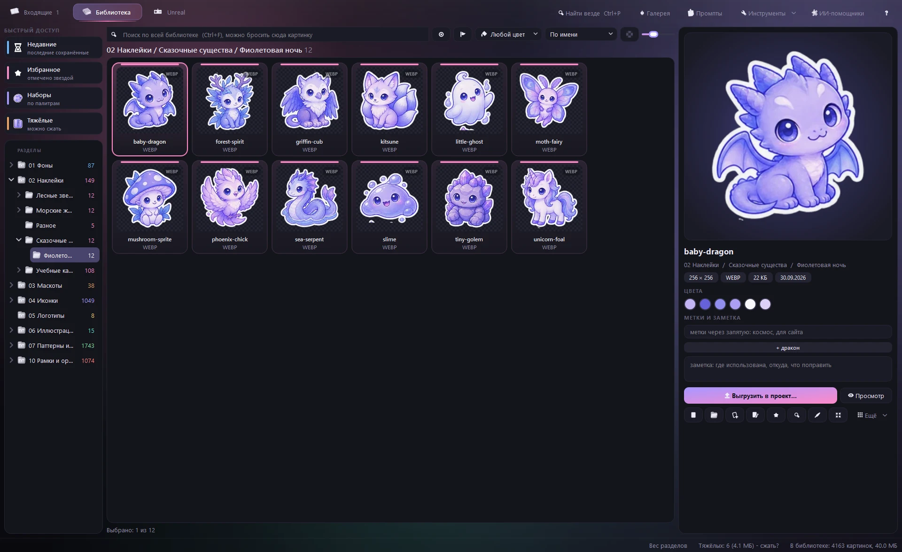
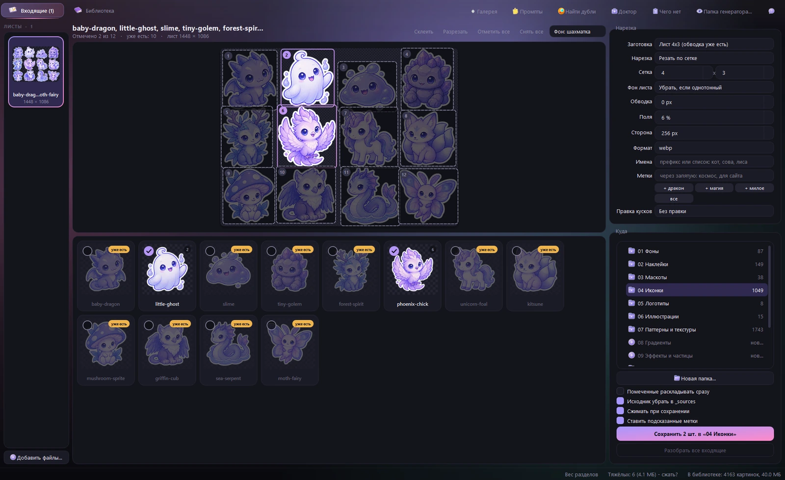
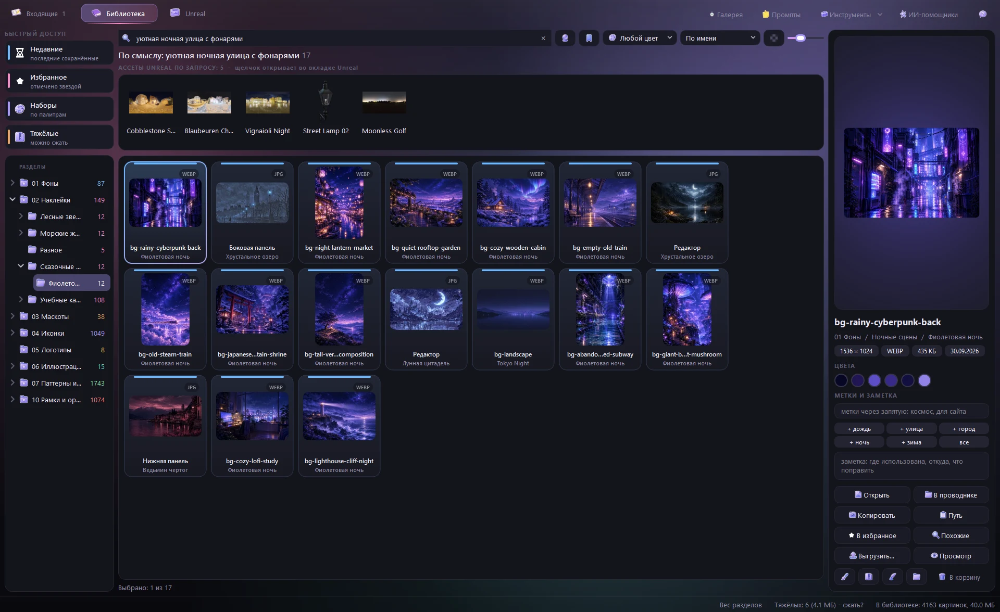
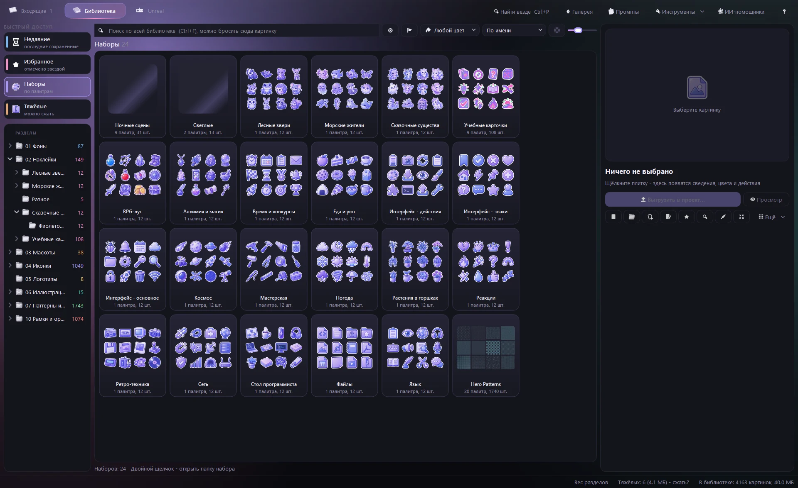

<div align="center">

**Русский** · [English](README.en.md)


# Библиотека картинок

### Своя библиотека иконок, наклеек и фонов с окном-сортировщиком: нарезает сгенерированные листы, раскладывает, ищет по смыслу

Нарезка листов 4x3 с предпросмотром · раскладка по разделам и палитрам · поиск по смыслу на русском<br>
подсказка меток · умные папки · правка, сжатие и выгрузка в проект · всё локально, без сети

[](https://github.com/moonlivedt-oss/photosMOONprojects/actions/workflows/ci.yml)




<sub>Одна папка · окно на PyQt6 · ядро на Pillow и numpy · поиск по смыслу через onnxruntime</sub>

</div>

---

## Быстрый старт

```bash
py -3.14 -m pip install PyQt6 pillow numpy onnxruntime
py -3.14 _tools/get_models.py      # модели поиска по смыслу, ~225 МБ, один раз
```

Затем запусти **`Library.cmd`** - откроется окно с двумя вкладками: «Входящие» и «Библиотека».

Отдельно:

```bash
_tools\run-tests.cmd                            # все тесты (32 проверки, окно не открывается)
py -3.14 _tools/cli.py gallery                  # пересобрать Gallery.html - вся библиотека в браузере
py -3.14 _tools/cli.py cut лист.png --grid 4x3  # нарезать лист без окна
```

> Без моделей окно работает как раньше, только кнопки поиска по смыслу и подсказки меток скрыты.
> Для страницы промптов (`Prompts.html`) и раздела «Чего нет» нужен node.

## Что это

Картинки для проектов (иконки, наклейки, маскоты, фоны) генерируются листами по 12 штук и
расползаются по папкам проектов: одно и то же лежит в трёх местах, найти «ту сову в фиолетовой
палитре» можно только перебором, а лист ещё надо порезать руками.

**Библиотека картинок** хранит всё в одном месте **по типам**, а не по проектам, и берёт на себя
рутину: лист падает во «Входящие» - окно режет его по сетке, называет куски по списку из промпта,
отмечает то, что уже есть, подсказывает метки и раскладывает в нужный раздел и палитру.

| | Обычная папка | Менеджеры картинок (Eagle и т. п.) | Библиотека картинок |
|---|---|---|---|
| Нарезка листа на куски | вручную | нет | **да - сетка или автопоиск, предпросмотр, рамки руками** |
| Раскладка по разделам | вручную | вручную | **да - по метке в имени файла сама** |
| «Это уже есть» | нет | нет | **да - отпечатки, повтор не сохраняется** |
| Поиск по смыслу | нет | платные AI-функции | **да - локально, по-русски («уютная ночная улица»)** |
| Поиск по картинке | нет | частично | **да - бросить файл в строку поиска** |
| Подсказка меток | нет | нет | **да - по смыслу кусков, щелчок ставит** |
| Умные папки | нет | да | **да - сохранённый поиск: слова, цвет, смысл** |
| Сжатие «на глаз» | нет | нет | **да - подбор качества по SSIM, выбор самого лёгкого формата** |
| Выгрузка в проект | вручную | частично | **да - формат, размер, @2x/@3x, атлас, svg-спрайт** |
| Где данные | на диске | своя база | **на диске, обычные файлы и папки** |

---

## Возможности

| Возможность | Подробности |
|---|---|
| **Входящие** | лист из папки `00 Входящие`, перетаскиванием или Ctrl+V; слежение за папкой генератора - новые картинки приходят сами |
| **Нарезка** | сетка 4x3 (слипшиеся по обводке соседи делятся), автопоиск рисунков, «целиком»; удаление однотонного фона, белая обводка, поля, сторона, формат; рамки правятся руками: тянуть край, Shift - новая, «Склеить» / «Разрезать» |
| **Метка в имени** | файл `Космос [ic tokyo]` сам выбирает нарезку, раздел и палитру, а имена 12 кусков берёт из `Prompts.html`; такие файлы можно раскладывать сразу, без окна |
| **«Уже есть»** | отпечаток каждого куска сверяется с библиотекой и с соседними листами пачки - повторы не отмечаются |
| **Поиск по смыслу** | кнопка-шар (Ctrl+M): «кот в космосе», «грустный маскот», «растение в горшке» - по-русски и по-английски, без слов в имени файла |
| **Поиск по картинке** | бросить файл из проводника или плитку в строку поиска - похожие по смыслу; «Похожие» и «Похожие по смыслу» в меню плитки |
| **Метки** | подсказки по смыслу во входящих и у выбранной картинки, галка «ставить сами» для пакетной раскладки; метки и заметки ищутся, метки - в дереве |
| **Умные папки** | сохранить поиск (слова, цвет, смысл) - папка в дереве пополняется сама |
| **Поиск по цвету** | 10 цветов по главным цветам картинки; палитра выбранной картинки, щелчок копирует HEX |
| **Наборы** | папка с подпапками палитр - одной обложкой; «Чего нет» - таблица карточек промптов по палитрам и перекраска из готовой |
| **Редактор** (Ctrl+R) | кадрирование, поворот, цвет, перекраска в палитру, убрать фон и кайму, кисть, обводка, тень, свечение, скругление, размер; рецепты; одна правка на много файлов |
| **Сжатие** (Ctrl+K) | подбор качества «разницы не видно» (SSIM + сдвиг цвета), «самый лёгкий формат», лимит в КБ, шторка до/после, по всем ядрам |
| **Выгрузка** (Ctrl+E) | в папку проекта: формат, размер, @1x/@2x/@3x, лимит, svg (vtracer), атлас png+json+css, svg-спрайт |
| **Доктор и дубли** | пустые, обрезанные, с остатками фона, с каймой, с куском соседа; одинаковые картинки - в `_duplicates` |
| **Отмена** | Ctrl+Z / Ctrl+Y и меню «История» для сохранения, переноса, переименования, сжатия и правки; оригиналы ждут в `_sources` |
| **Галерея** | `Gallery.html` - вся библиотека в браузере: разделы, поиск, размер плиток, копирование пути |

---

<div align="center">

<br><sub>Входящие: лист режется по сетке, повторы помечены «уже есть», справа - подсказанные метки</sub>
</div>

<div align="center">

<br><sub>Поиск по смыслу: в именах файлов нет ни «уютной», ни «улицы»</sub>
</div>

<div align="center">

<br><sub>Наборы: каждый набор одной обложкой, в подписи - палитры и число картинок</sub>
</div>

---

## Как пользоваться

1. Взять промпт в `Prompts.html`: выбрать палитру, «Копировать», для листа - «Имена».
2. Сгенерировать картинку и назвать файл именами через запятую или меткой (`Космос [ic tokyo]`).
3. Положить в `00 Входящие` или перетащить в окно.
4. Проверить нарезку, при желании добавить подсказанные метки и сохранить (Ctrl+S).
   Исходный лист уезжает в `_sources/<год-месяц>` - его можно перерезать.
5. Искать во вкладке «Библиотека» по имени, метке, цвету или смыслу; выгружать в проект - Ctrl+E.

Подробности про промпты, листы и палитры - в [Prompts.md](Prompts.md).

### Горячие клавиши

| Клавиши | Действие |
|---|---|
| `Ctrl+S` | сохранить отмеченные куски в раздел |
| `Ctrl+Z` / `Ctrl+Y` | отменить / вернуть отменённое |
| `Ctrl+V` | вставить картинку или файлы из буфера во входящие |
| `Ctrl+F` / `Ctrl+M` | поиск / поиск по смыслу |
| `Пробел` | во входящих - отметить кусок; в библиотеке - просмотр на всё окно |
| `Ctrl+R` / `Ctrl+K` / `Ctrl+E` | редактировать / сжать / выгрузить |
| `Ctrl+D` | в избранное |
| `Ctrl+I` | вес разделов |
| `F1` | все горячие клавиши |

---

## Поиск по смыслу

Работает полностью на этом компьютере, через `onnxruntime` (torch не нужен):

- **картинки** - CLIP ViT-B/32, квантованная ONNX-версия
  [`Xenova/clip-vit-base-patch32`](https://huggingface.co/Xenova/clip-vit-base-patch32);
- **текст** - многоязычный кодировщик
  [`sentence-transformers/clip-ViT-B-32-multilingual-v1`](https://huggingface.co/sentence-transformers/clip-ViT-B-32-multilingual-v1):
  русский и ещё 50+ языков в том же пространстве, что и картинки.

Модели (~225 МБ) не лежат в репозитории - GitHub не принимает файлы больше 100 МБ - и качаются
один раз: `py -3.14 _tools/get_models.py`. Векторы картинок окно считает в фоне и хранит в базе;
при первом запуске на ~4000 картинок уходит пара минут, потом досчитываются только новые.

Мелкие однотонные детали интерфейса похожи «на всё сразу» и лезли бы наверх любого запроса,
поэтому из оценки вычитается похожесть картинки на среднюю картинку библиотеки (у текста - на
набор общих слов). Подсказка меток сравнивает z-оценки словаря меток: у листа из 12 разных
предметов наверх выходят метки, общие для многих кусков («часы, время»).

## Командная строка

```bash
py -3.14 _tools/cli.py cut лист.png --grid 4x3 --names a,b,c --outline 8 --bg auto
py -3.14 _tools/cli.py convert папка --to webp --max 1920 [--replace]
py -3.14 _tools/cli.py dupes [папка]       # одинаковые - в _duplicates, не удаляются
py -3.14 _tools/cli.py gallery
```

Для перетаскивания файлов мышью - `.cmd` в `_tools/cli/`: нарезать лист, наклейки с обводкой,
частицы на чёрном, в WebP / PNG / ICO, найти дубли.

---

## FAQ / Решение проблем

**`Library.cmd` пишет «Нужны пакеты», хотя всё стоит.**
Скорее всего, у `.cmd` окончания строк LF вместо CRLF: после `chcp 65001` командная строка путает
строки, в выводе видно обрезанное `ONTWRITEBYTECODE`. В репозитории это закреплено
`.gitattributes`; если файл правился вручную - сохранить его с окончаниями CRLF.

**Нет кнопки-шара и подсказок меток.**
Нет моделей: `py -3.14 _tools/get_models.py`. Проверить: в `_tools/_models/clip` четыре файла.

**Внизу окна «Поиск по смыслу: учу картинки…».**
Окно считает векторы новых картинок. Поиск заработает, когда счётчик дойдёт до конца.

**Окно повело себя странно или закрылось.**
Ошибки пишутся в `_tools/_errors.log` - приложи его к issue.

**Картинка лежит боком.**
Некоторые jpg хранят пиксели повёрнутыми и флаг EXIF «поверни». Окно читает всё с учётом флага;
если боком в другой программе - это её особенность.

---

## Структура проекта

<details>
<summary><b>Развернуть дерево файлов и назначение модулей</b></summary>

```
00 Входящие/            неразобранное (в галерею и поиск не попадает)
01 Фоны/ ... 10 .../    разделы; наборы - <раздел>/<набор>/<палитра>/
_sources/               исходные листы (<год-месяц>), оригиналы до сжатия и правки, _undone для Ctrl+Y
_docs/screenshots/      картинки этого README
Library.cmd             запуск окна
Prompts.html            промпты для генерации (палитры, карточки, «Имена»)
_tools/
  app.py                вход окна
  cli.py                командная строка: cut, convert, dupes, gallery
  get_models.py         скачать модели поиска по смыслу
  imaging/              ядро без Qt (Pillow + numpy)
    files.py            пути, чтение с поворотом по EXIF, атомарная запись
    cutting.py          удаление фона, обводка, поиск рисунков, нарезка сеткой
    encoding.py         форматы, размер, SSIM «на глаз», сжатие, svg
    editing.py          правка по рецепту (цвет + шаги), перекраска, кисть, тень
    similarity.py       отпечатки (дубли, «уже есть»), главные цвета
    clip.py             CLIP через onnxruntime: свой WordPiece, чтение safetensors
    doctor.py           проверка библиотеки
    sprites.py          атлас, svg-спрайт, значки программы, лист превью
    jobs.py             задачи для процессов по ядрам
    gallery.py          сборка Gallery.html и done.js
  ui/                   окно (PyQt6)
    main_window.py      главное окно, отмена/возврат, приём файлов, main()
    inbox_tab.py        вкладка «Входящие»
    library_tab.py      вкладка «Библиотека», быстрый просмотр, умные папки, поиск по картинке
    sorting.py          заготовки нарезки, метки в имени, запись в разделы
    semantic.py         индекс поиска по смыслу; tagging.py - подсказка меток
    db.py               SQLite: отпечатки, метки, заметки, умные папки, векторы CLIP
    prompts.py          данные Prompts.html (через node)
    signatures.py       индекс отпечатков
    editor.py, compress.py, export.py, dupes.py, weight.py, doctor.py, missing.py - окна действий
    widgets.py, thumbnails.py, animations.py, theme.py, common.py - общее для окна
  tests/                unittest: эталонные листы, нарезка, правка, база, метки, CLIP
  cli/                  .cmd для перетаскивания файлов
```

Не в репозитории (`.gitignore`): `_tools/_models` (модели), `_tools/_thumbs` (кэш миниатюр),
`_tools/library.db` (база этого компьютера), `_tools/settings.json`, `Gallery.html`, `_tools/done.js`.

</details>

### Почему ядро отдельно от окна

`imaging/` не знает про Qt: его зовут и окно, и командная строка, и процессы по ядрам (сжатие
пачки идёт ~5x быстрее), и тесты. На входе и выходе задач - только путь, словарь и байты.

### Почему база, а не json

Отпечатки 4000 картинок раньше жили в 7-мегабайтном json, который переписывался после каждого
сохранения. В SQLite меняются только изменившиеся строки; там же метки, заметки, умные папки и
векторы CLIP (float16, ~1 КБ на картинку).

---

## Приватность

Окно **не ходит в сеть**: картинки, метки, поиск по смыслу - всё считается на этом компьютере.
Сеть нужна только один раз - `get_models.py` качает модели с Hugging Face. Ничего не отправляется.

## Ограничения

- Windows и Python 3.14 (запуск через `py -3.14`); на других ОС ядро и тесты работают, `.cmd` - нет.
- CLIP ViT-B/32 - небольшая модель: общий смысл ловит хорошо, мелкие детали и надписи - хуже.
- Подсказка меток идёт по словарю (~115 частых меток) плюс уже поставленные метки.

---

## История

Все изменения - в [CHANGELOG.md](CHANGELOG.md).

## Лицензия

Код (`_tools/`, `Library.cmd`, `Prompts.html`) - MIT, см. [LICENSE](LICENSE).
Картинки библиотеки под MIT не попадают: наборы Kenney - CC0, Hero Patterns - CC BY 4.0
(файлы `_авторы и лицензия.txt` в их папках), остальные картинки - автора репозитория.

---

<div align="center">
  <sub><b>Библиотека картинок</b> - сгенерировал лист, бросил во входящие, нашёл по смыслу.</sub>
  <br>
  <sub>Нашёл баг или есть идея? - <a href="https://github.com/moonlivedt-oss/photosMOONprojects/issues">Issues</a></sub>
</div>
