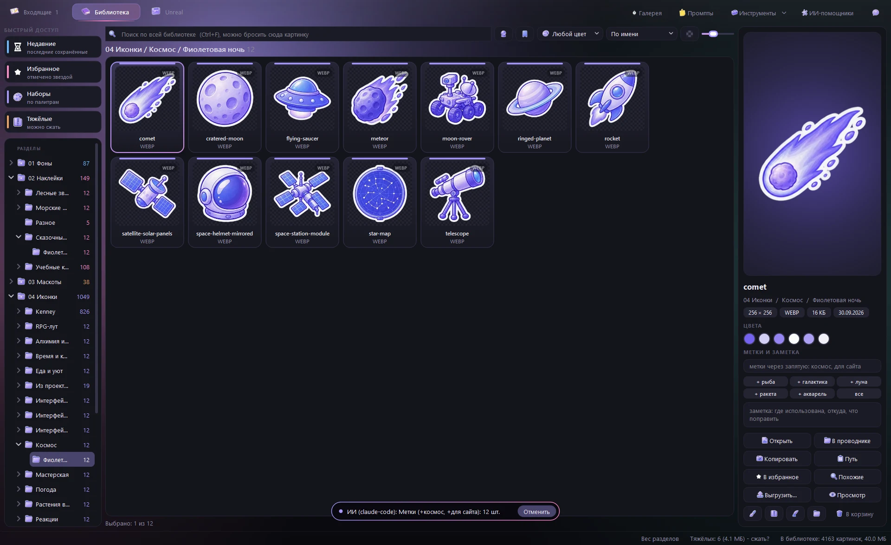
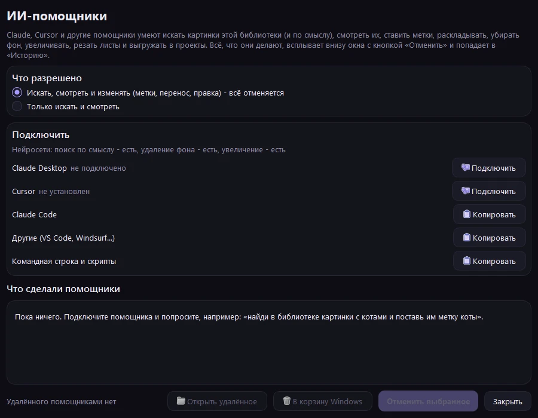

<div align="center">

**Русский** | [English](README.en.md)


# Библиотека картинок

### Своя библиотека иконок, наклеек и фонов с окном-сортировщиком: нарезает сгенерированные листы, раскладывает, ищет по смыслу

Нарезка листов 4x3 с предпросмотром, раскладка по разделам и палитрам, поиск по смыслу на русском<br>
подсказка меток и раздела, умные папки, нейросети: любой фон прочь, чёткое увеличение x4<br>
ИИ-помощники (Claude, Cursor) ищут, смотрят и правят картинки - всё видно в окне и отменяется

[](https://github.com/moonlivedt-oss/photosMOONprojects/actions/workflows/ci.yml)


<sub>Одна папка, окно на PyQt6, ядро на Pillow и numpy, поиск по смыслу через onnxruntime</sub>

</div>

---

## Быстрый старт

```bash
py -3.14 -m pip install PyQt6 pillow numpy onnxruntime
py -3.14 _tools/get_models.py      # модели нейросетей, ~460 МБ, один раз (можно частями: clip, bg, upscale)
```

Затем запусти **`Library.cmd`** - откроется окно с двумя вкладками: «Входящие» и «Библиотека».

Отдельно:

```bash
_tools\run-tests.cmd                            # все тесты (53 проверки, окно не открывается)
py -3.14 _tools/cli.py gallery                  # пересобрать Gallery.html - вся библиотека в браузере
py -3.14 _tools/cli.py cut лист.png --grid 4x3  # нарезать лист без окна
```

Подключить ИИ-помощника (Claude Code, Claude Desktop, Cursor) - кнопка **«ИИ-помощники»** в окне,
подробности - в разделе [ИИ-помощники](#ии-помощники). Claude Code, открытый в этой папке, находит
библиотеку сам.

> Без моделей окно работает как раньше, только кнопки нейросетей скрыты или неактивны.
> Для страницы промптов (`Prompts.html`) и раздела «Чего нет» нужен node.

## Что это

Картинки для проектов (иконки, наклейки, маскоты, фоны) генерируются листами по 12 штук и
расползаются по папкам проектов: одно и то же лежит в трёх местах, найти «ту сову в фиолетовой
палитре» можно только перебором, а лист ещё надо порезать руками.

**Библиотека картинок** хранит всё в одном месте **по типам**, а не по проектам, и берёт на себя
рутину: лист падает во «Входящие» - окно режет его по сетке, называет куски по списку из промпта,
отмечает то, что уже есть, подсказывает метки и раскладывает в нужный раздел и палитру.

| | Обычная папка | Менеджеры картинок (Eagle и т. п.) | Библиотека картинок |
|---|---|---|---|
| Нарезка листа на куски | вручную | нет | **да - сетка или автопоиск, предпросмотр, рамки руками** |
| Раскладка по разделам | вручную | вручную | **да - по метке в имени файла сама** |
| «Это уже есть» | нет | нет | **да - отпечатки, повтор не сохраняется** |
| Поиск по смыслу | нет | платные AI-функции | **да - локально, по-русски («уютная ночная улица»)** |
| Поиск по картинке | нет | частично | **да - бросить файл в строку поиска** |
| Подсказка меток | нет | нет | **да - по смыслу кусков, щелчок ставит** |
| Умные папки | нет | да | **да - сохранённый поиск: слова, цвет, смысл** |
| Фон с любой картинки | нет | нет | **да - нейросеть BiRefNet, локально** |
| Увеличение без мыла | нет | нет | **да - Real-ESRGAN x2/x4, отдельно для рисунков и фото** |
| Где использовано | нет | нет | **да - журнал выгрузок в проекты** |
| ИИ-помощники | нет | нет | **да - сервер MCP: ищут, смотрят, правят, раскладывают; всё отменяется** |
| Отмена | корзина | частично | **да - любое действие, и после перезапуска окна** |
| Сжатие «на глаз» | нет | нет | **да - подбор качества по SSIM, выбор самого лёгкого формата** |
| Выгрузка в проект | вручную | частично | **да - формат, размер, @2x/@3x, атлас, svg-спрайт** |
| Где данные | на диске | своя база | **на диске, обычные файлы и папки** |

---

## Возможности

| Возможность | Подробности |
|---|---|
| **Входящие** | лист из папки `00 Входящие`, перетаскиванием или Ctrl+V; слежение за папкой генератора - новые картинки приходят сами; фон или иллюстрация сами сохраняются целиком, одиночный рисунок - вырезается |
| **«Похоже на: раздел»** | по смыслу кусков окно подсказывает, где в библиотеке лежат похожие картинки, - щелчок выбирает этот раздел |
| **Нарезка** | сетка 4x3 (слипшиеся по обводке соседи делятся), автопоиск рисунков, «целиком»; удаление однотонного фона, белая обводка, поля, сторона, формат; рамки правятся руками: тянуть край, Shift - новая, «Склеить» / «Разрезать» |
| **Метка в имени** | файл `Космос [ic tokyo]` сам выбирает нарезку, раздел и палитру, а имена 12 кусков берёт из `Prompts.html`; такие файлы можно раскладывать сразу, без окна |
| **«Уже есть»** | отпечаток каждого куска сверяется с библиотекой и с соседними листами пачки - повторы не отмечаются |
| **Поиск по смыслу** | кнопка-шар (Ctrl+M): «кот в космосе», «грустный маскот», «растение в горшке» - по-русски и по-английски, без слов в имени файла; если по именам ничего нет, поиск сам показывает похожее по смыслу |
| **ИИ-помощники** | Claude, Cursor и др. через MCP или командную строку: поиск, просмотр, метки, перенос, правка, фон, увеличение, нарезка листов, выгрузка; действия всплывают в окне с кнопкой «Отменить»; режим «только смотреть» |
| **Поиск по картинке** | бросить файл из проводника или плитку в строку поиска - похожие по смыслу; «Похожие» и «Похожие по смыслу» в меню плитки |
| **Метки** | подсказки по смыслу во входящих и у выбранной картинки, галка «ставить сами» для пакетной раскладки; метки и заметки ищутся, метки - в дереве |
| **Нейросети в правке** | «Убрать фон нейросетью» - любой фон, не только однотонный (BiRefNet-lite); «x2» / «x4» - чёткое увеличение (Real-ESRGAN: модель для рисунков бережёт контуры, для фото - текстуры, прозрачность увеличивается вместе с картинкой); во входящих - фон листа «Убрать нейросетью»; в командной строке - `nobg`, `upscale`, `cut --bg ai` |
| **Массовые метки** | «Поставить подсказанные метки» разделу или выделению: сначала видно, какие метки и сколько, потом одним нажатием; лишняя метка снимается у всех правым щелчком в дереве |
| **Где использовано** | выгрузка (Ctrl+E) запоминает папку проекта; под путём картинки - «Выгружено в: VSCodeLauncher / assets» |
| **Умные папки** | сохранить поиск (слова, цвет, смысл) - папка в дереве пополняется сама |
| **Поиск по цвету** | 10 цветов по главным цветам картинки; палитра выбранной картинки, щелчок копирует HEX |
| **Наборы** | папка с подпапками палитр - одной обложкой; «Чего нет» - таблица карточек промптов по палитрам и перекраска из готовой |
| **Редактор** (Ctrl+R) | кадрирование, поворот, цвет, перекраска в палитру, убрать фон и кайму, кисть, обводка, тень, свечение, скругление, размер; рецепты; одна правка на много файлов |
| **Сжатие** (Ctrl+K) | подбор качества «разницы не видно» (SSIM + сдвиг цвета), «самый лёгкий формат», лимит в КБ, шторка до/после, по всем ядрам |
| **Выгрузка** (Ctrl+E) | в папку проекта: формат, размер, @1x/@2x/@3x, лимит, svg (vtracer), атлас png+json+css, svg-спрайт |
| **Доктор и дубли** | пустые, обрезанные, с остатками фона, с каймой, с куском соседа; одинаковые картинки - в `_duplicates` |
| **Отмена** | Ctrl+Z / Ctrl+Y, меню «История» и кнопка «Отменить» в сообщении - для сохранения, переноса, переименования, корзины, сжатия, правки и действий помощников; история помнит и после перезапуска; оригиналы ждут в `_sources` |
| **Справка** (F1) | разделы и поиск по ним; «Что нового» после обновления, «С чего начать» при первом запуске |
| **Unreal** (Ctrl+3) | PBR-текстуры, небо HDRI, 3D-модели и IES-профили света по темам; просмотр в 3D (модель, текстура на шаре, панорама 360); «Скачать ещё...» - с Poly Haven и ambientCG (CC0); плитка тянется прямо в Content Browser, справа - как подключить ассет в Unreal |
| **Галерея** | `Gallery.html` - вся библиотека в браузере: разделы, поиск, размер плиток, копирование пути |

---

<div align="center">

<br><sub>Входящие: лист режется по сетке, повторы помечены «уже есть», справа - подсказанные метки</sub>
</div>

<div align="center">

<br><sub>Поиск по смыслу: в именах файлов нет ни «уютной», ни «улицы»</sub>
</div>

<div align="center">

<br><sub>Наборы: каждый набор одной обложкой, в подписи - палитры и число картинок</sub>
</div>

---

## Как пользоваться

1. Взять промпт в `Prompts.html`: выбрать палитру, «Копировать», для листа - «Имена».
2. Сгенерировать картинку и назвать файл именами через запятую или меткой (`Космос [ic tokyo]`).
3. Положить в `00 Входящие` или перетащить в окно.
4. Проверить нарезку, при желании добавить подсказанные метки и сохранить (Ctrl+S).
   Исходный лист уезжает в `_sources/<год-месяц>` - его можно перерезать.
5. Искать во вкладке «Библиотека» по имени, метке, цвету или смыслу; выгружать в проект - Ctrl+E.

Подробности про промпты, листы и палитры - в [Prompts.md](Prompts.md).

### Инструменты

Кнопка «Инструменты» вверху и правый щелчок по картинке -> «Инструменты»: найти дубли, доктор, «Чего нет»,
вес разделов, **палитра из картинки** (и перекраска других в неё), **сравнение двух версий** (шторка,
разница, SSIM), **векторизация в SVG** (три варианта рядом), **оформление** - тёмная или светлая тема и
акцент на выбор.

### Горячие клавиши (все - в справке, F1)

| Клавиши | Действие |
|---|---|
| `Ctrl+S` | сохранить отмеченные куски в раздел |
| `Ctrl+Z` / `Ctrl+Y` | отменить / вернуть отменённое |
| `Ctrl+V` | вставить картинку или файлы из буфера во входящие |
| `Ctrl+F` / `Ctrl+M` | поиск / поиск по смыслу |
| `Пробел` | во входящих - отметить кусок; в библиотеке - просмотр на всё окно |
| `Ctrl+R` / `Ctrl+K` / `Ctrl+E` | редактировать / сжать / выгрузить |
| `Ctrl+D` | в избранное |
| `Ctrl+1` / `Ctrl+2` / `Ctrl+3` | вкладки: входящие / библиотека / Unreal |
| `Ctrl+I` | вес разделов |
| `F2` | переименовать; несколько выбранных - одно имя с номерами |
| `F1` | справка: всё, что умеет окно, с поиском |

## Ассеты для Unreal Engine

Вкладка **«Unreal»** (Ctrl+3) - отдельная полка для 3D: она не смешивается с картинками библиотеки.
Всё лежит в `_Unreal/<вид>/<тема>/<имя>/`: файлы ассета, `preview.webp` и `asset.json` (источник,
автор, метки, лицензия, подсказка для Unreal). Папка на `_`, поэтому галерея, дубли и поиск её не трогают;
в git она не попадает (`.gitignore`) - ассеты скачиваются заново кнопкой.

| Вид | Что внутри | Как в Unreal |
|---|---|---|
| **PBR-текстуры** | цвет, нормаль DirectX, ARM (AO + шероховатость + металл), высота; 1K/2K/4K | перетащить в Content Browser; у нормали - Normalmap, у ARM и высоты снять sRGB |
| **Небо и фоны HDRI** | `.hdr` и превью | станет Texture Cube: HDRI Backdrop или Sky Light -> Specified Cubemap |
| **3D-модели** | `.fbx` + текстуры (и нормаль DirectX отдельно) | перетащить `.fbx`, в импорте - Import Materials / Textures |
| **IES-профили света** | 12 своих профилей: узкий луч, кольца, уличный фонарь, полосы... | Point/Spot Light -> Light Profiles -> IES Texture |

**Слева** - карточки видов, у каждого свой цвет (текстуры - оранжевый, HDRI - голубой, модели - фиолетовый,
IES - жёлтый, избранное - розовый); тем же цветом - черта на плитках. Ниже - темы только выбранного вида.
«Дом» разбит по назначению: кровати, диваны, стулья и кресла, столы, шкафы и полки, кухня и посуда, ванная,
свет, техника, декор, растения, стены и двери, мелочи - вместе модели Poly Haven и Kenney (раздел
определяется по имени, меткам и категориям, `unreal.home_section`); «Только Kenney» и «Только Quaternius» -
отдельно. Простые модели [Quaternius](https://quaternius.com) (Ultimate Home Interior и Furniture, CC0) берутся
из открытых папок Google Drive; превью к ним рисует сама библиотека 3D-сценой окна (`ui/render_previews.py`,
`cli.py unreal previews`). Сверху - поиск, сортировка (по видам, имени, новизне, весу) и размер
плиток; звезда (Ctrl+D) - в избранное.

**Карточки** - у каждого вида своя подача: модель и текстура стоят на «студийном» пятне света с тенью,
HDRI и IES - картинкой во всю карточку, панорама HDRI медленно едет при наведении; ярлык вида, разрешение,
вес при наведении, звезда избранного.

**Справа** - живой 3D: выбранная модель медленно вращается на подставке (тянуть мышью - поворот),
текстура - на шаре, HDRI - панорама; кнопка-кубик выключает его.

**Поиск по смыслу** (кнопка-шар у поиска): «деревянный стул», «ржавый металл», «закат», «лампа» - по-русски,
без слов в имени; та же модель CLIP, что у картинок, плюс имя и метки ассета.

**Каталог...** - весь Poly Haven прямо в окне: вид, категория, поиск, «только новые»; щелчок отмечает
карточку, «Скачать отмеченные» качает их, тема для папки подбирается сама. Уже скачанное помечено.

**Правый щелчок** - «Перекачать в разрешении» 1K/2K/4K (на то же место) и «В корзину» (Del).

**Импорт в Unreal одним скриптом** (кнопка на панели и в меню): файлы копируются в выбранную папку, рядом -
`import_to_unreal.py`. В Unreal: Tools -> Execute Python Script (или в Output Log `py "путь"` - команда уже
в буфере обмена). Скрипт импортирует всё в `Content/Library/<вид>/<имя>`, у карт текстур сам снимает sRGB и
ставит Normalmap / Masks и собирает материал `M_<имя>` (цвет, нормаль, ARM -> AO, Roughness, Metallic).
Нужен плагин Python Editor Script Plugin.

**Ещё:** подборки (правый щелчок -> «В подборку», карточка «Подборки» слева), «Новое» - скачанное с прошлого
открытия окна, «Похожие по виду», фильтр по полигонам (до 5k / 20k / 100k) и по цвету, заметка к ассету
(по ней ищется), «Освещать этим HDRI в 3D-просмотре», ход загрузки в строке состояния (щелчок - окно загрузки),
кнопка-аптечка «Проверить ассеты» - пропавшие файлы, пустые FBX, недокачанные папки.

**Просмотр в 3D** - двойной щелчок по плитке, Enter или «Смотреть в 3D» (на Qt Quick 3D, который уже есть в
PyQt6, отдельно ставить ничего не надо). Слева - лента ассетов того же раздела (стрелки - соседний), справа -
настройки и сведения:

| | Что можно |
|---|---|
| **Модель** | вращать, приближать, сдвигать; пол с тенью и сеткой (G), вращение на подставке (Пробел), каркас (W) |
| **Текстура** | на шаре, кубе или плоскости, повтор, рельеф; каждую карту (цвет, нормаль, шероховатость, металл, AO, высота) - отдельно плиткой |
| **HDRI** | панорама 360 изнутри, колесо - угол обзора, шары-пробники, развёртка целиком |
| **Свет** | модель и текстура освещаются любым скачанным HDRI (студийный - по умолчанию), небо фоном, яркость, поворот |

«Снимок» сохраняет то, что видно, в PNG.

Темы: лес и природа, город, интерьер, индустрия и sci-fi, средневековье и фэнтези, пустыня и скалы, зима,
ночь и закат, студия; модели для дома - отдельными темами «Дом - мебель», «кухня и посуда», «декор»,
«свет и техника», «растения», «мелочи» и «Дом - Kenney low-poly» (140 простых моделей мебели для черновой
расстановки комнат, [Kenney Furniture Kit](https://kenney.nl/assets/furniture-kit), CC0). «Скачать ещё...» - вид, тема (или все), сколько на тему, разрешение; уже скачанное
пропускается, загрузку можно остановить. Источники - [Poly Haven](https://polyhaven.com) и
[ambientCG](https://ambientcg.com), модели для дома ещё и [Kenney](https://kenney.nl), лицензия **CC0**: бесплатно, в любые проекты, указывать автора не нужно.
IES-профили рисует сама библиотека (`imaging/ies.py`).

```bash
py -3.14 _tools/cli.py unreal                                   # что скачано, по видам и темам
py -3.14 _tools/cli.py unreal get tex "Город" --count 6 --res 2k  # tex | hdri | model | ies; тема или «все»
```

---

## ИИ-помощники

<div align="center">

<br><sub>Помощник поставил метки - окно сразу показывает это и предлагает отменить</sub>
</div>

Claude, Cursor и другие помощники работают с библиотекой как с инструментом: «найди наклейки с
котами и поставь им метку коты», «убери фон у этих трёх и положи копии в 02 Наклейки/Котики»,
«нарежь лист из входящих», «выгрузи иконки космоса в D:/site/assets в webp 128».

**Подключить** - кнопка «ИИ-помощники» вверху окна: Claude Desktop и Cursor одной кнопкой, для Claude
Code и остальных - скопировать команду или блок настроек. В этой папке Claude Code находит сервер сам
(`.mcp.json`). Без MCP - те же операции из командной строки: `py -3.14 _tools/cli.py api`.

| Что | Операции |
|---|---|
| Понять, что где | `overview`, `list_folder`, `inbox`, `palettes`, `history` |
| Найти | `search` (слова, метки, цвет, смысл), `similar`, `duplicates`, `check` (доктор) |
| Посмотреть | `view` - картинка или лист с номерами приходит помощнику изображением; `info` |
| Подписать | `suggest_tags`, `tag`, `note`, `favorite`, `smart_folder` |
| Разложить | `rename`, `move`, `trash`, `import_images`, `cut_sheet` |
| Поправить | `edit` (рецепт как в редакторе, сначала предпросмотр), `remove_background`, `upscale`, `convert` |
| Отдать в проект | `export` (форматы, @2x/@3x, атлас, svg-спрайт) |
| Вернуть | `undo` |

**Безопасно.** Каждое действие помощника записывается в журнал: в окне оно всплывает сообщением с
кнопкой «Отменить» и попадает в «Историю» (Ctrl+Z). Удалённое помощником не стирается, а лежит в
`_sources/_deleted`; при замене оригинал уходит в `_sources/edit <дата>`. Помощнику можно разрешить
только поиск и просмотр. Как помощнику вести себя с библиотекой - в [AGENTS.md](AGENTS.md).

<div align="center">

<br><sub>Окно «ИИ-помощники»: подключение, права и всё, что помощники сделали</sub>
</div>

---

## Нейросети

### Поиск по смыслу и метки

Работает полностью на этом компьютере, через `onnxruntime` (torch не нужен):

- **картинки** - CLIP ViT-B/32, квантованная ONNX-версия
  [`Xenova/clip-vit-base-patch32`](https://huggingface.co/Xenova/clip-vit-base-patch32);
- **текст** - многоязычный кодировщик
  [`sentence-transformers/clip-ViT-B-32-multilingual-v1`](https://huggingface.co/sentence-transformers/clip-ViT-B-32-multilingual-v1):
  русский и ещё 50+ языков в том же пространстве, что и картинки.

Модели (~225 МБ) не лежат в репозитории - GitHub не принимает файлы больше 100 МБ - и качаются
один раз: `py -3.14 _tools/get_models.py`. Векторы картинок окно считает в фоне и хранит в базе;
при первом запуске на ~4000 картинок уходит пара минут, потом досчитываются только новые.

Мелкие однотонные детали интерфейса похожи «на всё сразу» и лезли бы наверх любого запроса,
поэтому из оценки вычитается похожесть картинки на среднюю картинку библиотеки (у текста - на
набор общих слов). Подсказка меток сравнивает z-оценки словаря меток: у листа из 12 разных
предметов наверх выходят метки, общие для многих кусков («часы, время»).

### Удаление фона и увеличение

- **фон** - [`onnx-community/BiRefNet_lite-ONNX`](https://huggingface.co/onnx-community/BiRefNet_lite-ONNX) (MIT, 224 МБ): маска объекта на любом фоне, ~5-10 с на картинку на процессоре;
- **увеличение** - [Real-ESRGAN](https://github.com/xinntao/Real-ESRGAN) (BSD-3): `realesr-animevideov3` для рисунков и `realesr-general-x4v3` для фото, по 2-5 МБ, кусок 256 px -> 1024 px меньше чем за секунду; картинка режется на плитки, так что память не растёт с размером.

Real-ESRGAN выложен только для PyTorch: `get_models.py` скачивает веса и один раз переводит их в ONNX (`imaging/convert_upscalers.py`, нужны `torch` и `onnx`); окну torch не нужен.
Результаты нейросетей кэшируются: предпросмотр правки не ждёт их заново на каждый ползунок.

## Командная строка

```bash
py -3.14 _tools/cli.py cut лист.png --grid 4x3 --names a,b,c --outline 8 --bg auto
py -3.14 _tools/cli.py convert папка --to webp --max 1920 [--replace]
py -3.14 _tools/cli.py dupes [папка]       # одинаковые - в _duplicates, не удаляются
py -3.14 _tools/cli.py gallery
py -3.14 _tools/cli.py nobg картинка.jpg                 # -> «картинка без фона.png»
py -3.14 _tools/cli.py upscale иконка.png --x 4 --kind art   # -> «иконка x4.png»
py -3.14 _tools/cli.py unreal get hdri все --count 3     # ассеты для Unreal Engine (CC0)
py -3.14 _tools/cli.py api                               # операции для помощников и скриптов, ответ - JSON
py -3.14 _tools/cli.py api search '{"query": "уютная ночная улица"}'
```

Для перетаскивания файлов мышью - `.cmd` в `_tools/cli/`: нарезать лист, наклейки с обводкой,
частицы на чёрном, в WebP / PNG / ICO, найти дубли.

---

## FAQ / Решение проблем

**`Library.cmd` пишет «Нужны пакеты», хотя всё стоит.**
Скорее всего, у `.cmd` окончания строк LF вместо CRLF: после `chcp 65001` командная строка путает
строки, в выводе видно обрезанное `ONTWRITEBYTECODE`. В репозитории это закреплено
`.gitattributes`; если файл правился вручную - сохранить его с окончаниями CRLF.

**Нет кнопки-шара и подсказок меток.**
Нет моделей: `py -3.14 _tools/get_models.py`. Проверить: в `_tools/_models/clip` четыре файла.

**Внизу окна «Поиск по смыслу: учу картинки…».**
Окно считает векторы новых картинок. Поиск заработает, когда счётчик дойдёт до конца.

**Помощник не видит библиотеку.**
Окно «ИИ-помощники» показывает, подключён ли Claude Desktop и Cursor; после подключения клиента его нужно
перезапустить. Проверить сервер без помощника: `py -3.14 _tools/cli.py api overview`.

**Помощник сделал не то.**
«История» внизу окна или кнопка «Отменить» в сообщении; в окне «ИИ-помощники» - список всех его действий.

**Окно повело себя странно или закрылось.**
Ошибки пишутся в `_tools/_errors.log` - приложи его к issue.

**Картинка лежит боком.**
Некоторые jpg хранят пиксели повёрнутыми и флаг EXIF «поверни». Окно читает всё с учётом флага;
если боком в другой программе - это её особенность.

---

## Структура проекта

<details>
<summary><b>Развернуть дерево файлов и назначение модулей</b></summary>

```
00 Входящие/            неразобранное (в галерею и поиск не попадает)
01 Фоны/ ... 10 .../    разделы; наборы - <раздел>/<набор>/<палитра>/
_sources/               исходные листы (<год-месяц>), оригиналы до сжатия и правки, _undone для Ctrl+Y
_Unreal/                ассеты для Unreal Engine: <вид>/<тема>/<имя>/ (не в git)
_docs/screenshots/      картинки этого README
Library.cmd             запуск окна
Prompts.html            промпты для генерации (палитры, карточки, «Имена»)
AGENTS.md               как ИИ-помощнику работать с библиотекой (CLAUDE.md ссылается на него)
.mcp.json               сервер для Claude Code, открытого в этой папке
_tools/
  app.py                вход окна
  mcp_server.py         сервер MCP для ИИ-помощников (stdin/stdout, без сторонних пакетов)
  cli.py                командная строка: cut, convert, dupes, gallery, nobg, upscale, unreal, api
  get_models.py         скачать модели поиска по смыслу
  imaging/              ядро без Qt (Pillow + numpy)
    files.py            пути, чтение с поворотом по EXIF, атомарная запись
    cutting.py          удаление фона, обводка, поиск рисунков, нарезка сеткой
    encoding.py         форматы, размер, SSIM «на глаз», сжатие, svg
    editing.py          правка по рецепту (цвет + шаги), перекраска, кисть, тень
    similarity.py       отпечатки (дубли, «уже есть»), главные цвета
    clip.py             CLIP через onnxruntime: свой WordPiece, чтение safetensors
    ies.py              IES-профили света для Unreal и их превью «пятно на стене»
    neural.py           удаление фона (BiRefNet) и увеличение (Real-ESRGAN), кэш результатов
    convert_upscalers.py  Real-ESRGAN из .pth в .onnx (один раз, через torch)
    doctor.py           проверка библиотеки
    sprites.py          атлас, svg-спрайт, значки программы, лист превью
    jobs.py             задачи для процессов по ядрам
    gallery.py          сборка Gallery.html и done.js
  library/              модель библиотеки без Qt - её делят окно, командная строка и сервер MCP
    api.py              операции для помощников: описания, схемы параметров, журнал, отмена
    journal.py          журнал действий в базе: история окна и действия помощников, отмена и возврат
    db.py               SQLite: отпечатки, метки, заметки, избранное, умные папки, векторы CLIP, журнал
    batch.py            пакетно по ядрам: сжатие, копии, правка по рецепту, выгрузка
    semantic.py         индекс поиска по смыслу; tagging.py - подсказка меток и раздела
    signatures.py       отпечатки: «уже есть», похожие, цвет, дубли
    sorting.py          заготовки нарезки, метки в имени, запись в разделы
    prompts.py          данные Prompts.html (через node)
  ui/                   окно (PyQt6)
    main_window.py      главное окно, отмена/возврат, приём файлов, main()
    inbox_tab.py        вкладка «Входящие»
    library_tab.py      вкладка «Библиотека», быстрый просмотр, умные папки, поиск по картинке
    semantic.py, signatures.py - то же, что в library, но досчёт в фоне
    agents.py           окно «ИИ-помощники»; help.py - справка
    editor.py, compress.py, export.py, dupes.py, weight.py, doctor.py, missing.py - окна действий
    widgets.py, thumbnails.py, animations.py, theme.py, common.py - общее для окна
  tests/                unittest: эталонные листы, нарезка, правка, база, метки, CLIP;
                        test_api.py - операции для помощников и протокол MCP на временной библиотеке
  cli/                  .cmd для перетаскивания файлов
```

Не в репозитории (`.gitignore`): `_tools/_models` (модели), `_tools/_thumbs` (кэш миниатюр),
`_tools/library.db` (база этого компьютера), `_tools/settings.json`, `Gallery.html`, `_tools/done.js`.

</details>

### Почему ядро отдельно от окна

`imaging/` и `library/` не знают про Qt: их зовут и окно, и командная строка, и сервер для
помощников, и процессы по ядрам (сжатие пачки идёт ~5x быстрее), и тесты. Окно и помощник
работают с одной базой (SQLite в режиме WAL): метка, поставленная помощником, сразу видна в окне,
а его действие отменяется в окне так же, как своё.

### Почему база, а не json

Отпечатки 4000 картинок раньше жили в 7-мегабайтном json, который переписывался после каждого
сохранения. В SQLite меняются только изменившиеся строки; там же метки, заметки, умные папки и
векторы CLIP (float16, ~1 КБ на картинку).

---

## Приватность

Окно **не ходит в сеть**: картинки, метки, поиск по смыслу - всё считается на этом компьютере.
Сеть нужна только один раз - `get_models.py` качает модели с Hugging Face и GitHub. Ничего не отправляется.

Сервер для помощников тоже работает локально и сам ничего не отправляет. Но то, что помощник
смотрит (`view`, предпросмотр правки) или читает (имена, метки), уходит его модели - как любой
файл, который вы ему показываете. Если картинки нельзя показывать внешним сервисам, не подключайте
помощника с облачной моделью.

## Ограничения

- Windows и Python 3.14 (запуск через `py -3.14`); на других ОС ядро и тесты работают, `.cmd` - нет.
- CLIP ViT-B/32 - небольшая модель: общий смысл ловит хорошо, мелкие детали и надписи - хуже.
- Подсказка меток идёт по словарю (~115 частых меток) плюс уже поставленные метки.

---

## История

Все изменения - в [CHANGELOG.md](CHANGELOG.md).

## Лицензия

Код (`_tools/`, `Library.cmd`, `Prompts.html`) - MIT, см. [LICENSE](LICENSE).
Картинки библиотеки под MIT не попадают: наборы Kenney - CC0, Hero Patterns - CC BY 4.0
(файлы `_авторы и лицензия.txt` в их папках), остальные картинки - автора репозитория.

---

<div align="center">
  <sub><b>Библиотека картинок</b> - сгенерировал лист, бросил во входящие, нашёл по смыслу.</sub>
  <br>
  <sub>Нашёл баг или есть идея? - <a href="https://github.com/moonlivedt-oss/photosMOONprojects/issues">Issues</a></sub>
</div>
